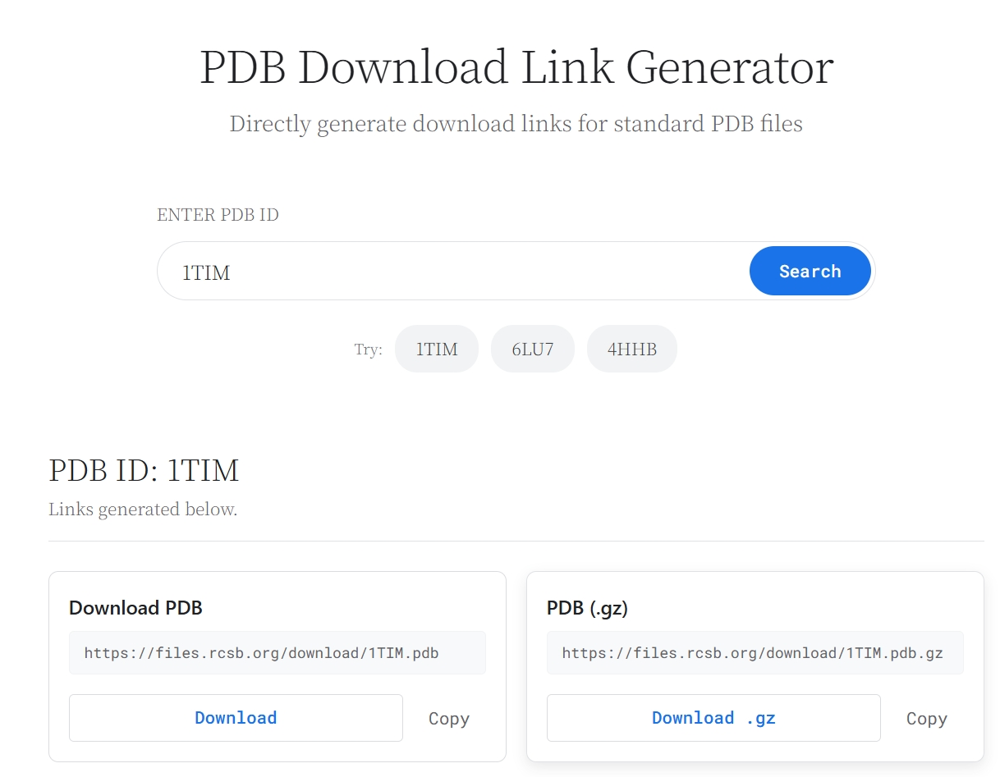

**Offline PDB Link Generator**
A static web tool for structural biology researchers. Enter a PDB ID to instantly generate direct download links for corresponding structure files and related database pages.

**Project thumbnail:**

**Read this in other languages:[English](README.md), [中文](README_zh.md)**

**Online trial use**
-https://pdbdownloader.netlify.app/

**LOCAL RUNNING**
-Open "index.html" and you can easily use it.

**Main Advantages**
* Offline run,stable and quick response,and no risk of privacy leakage.
* Easily download molecular data to enhance research efficiency.

**Features**
*   **Instant Link Generation**: Input a PDB ID to get a complete set of direct URLs.
*   **Multiple File Formats**: Generate links for PDB, mmCIF, XML files and their compressed versions.
*   **Integrated Database Access**: Direct links to entry pages on RCSB PDB, PDBe, PDBsum, and UniProt search.
*   **Privacy-First & Offline**: Runs entirely in your browser; no data is sent to any server.
*   **Responsive Design**: Works on both desktop and mobile devices.
*   **Copy Functionality**: One-click copying of any generated URL to the clipboard.